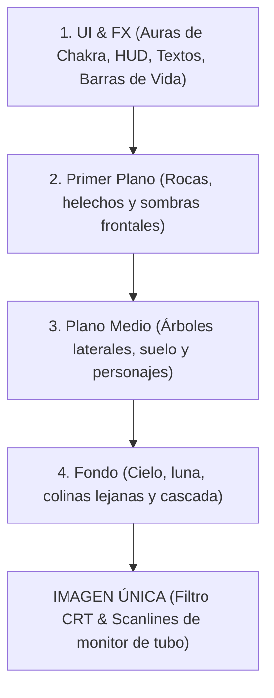

# Guía de Dirección de Arte: Batallas y Sprites (16-Bit Neo-Retro)

Este documento analiza en detalle la estructura visual de las escenas de batalla de **Shinobi Way: The Infinite Tower**, basándose en el análisis de la composición de capas (`Gemini_Generated_Image_64gaug64gaug64ga.png`) y el estilo pixel art clásico arcade de `naruto_retro_arcada.jfif`.

---

## 📸 1. Análisis de Composición por Capas (Deconstrucción)

La imagen `Gemini_Generated_Image_64gaug64gaug64ga.png` demuestra que la escena de batalla debe construirse en **capas superpuestas (Laminas)** en lugar de usar un fondo plano. Esto permite efectos de profundidad, parallax y animaciones focalizadas sin sobrecargar el rendimiento.



### Detalle de las Capas

1.  **Capa 4: Fondo (Background Elements)**
    *   **Contenido**: El cielo nocturno degradado (azul oscuro a violeta), la luna creciente brillante, siluetas de montañas boscosas cubiertas por la niebla y la cascada central en caída libre.
    *   **Función**: Aporta la atmósfera global y la profundidad. Al usar tonos más fríos y desaturados, hace que los personajes del plano medio resalten más.
    *   **Animación**: La cascada puede animarse mediante un loop simple de 4 frames de píxeles.
2.  **Capa 3: Estructura del Plano Medio (Middle-ground Structure)**
    *   **Contenido**: El suelo de tierra/arena transitable, y los dos árboles monumentales con musgo e hiedra a los lados que enmarcan el duelo.
    *   **Función**: Es la base física donde se posicionan y mueven los sprites de los personajes (Hikaru y Kagero). Los árboles laterales actúan como límites visuales naturales.
3.  **Capa 2: Elementos de Primer Plano (Foreground Elements)**
    *   **Contenido**: Rocas oscuras en los extremos inferiores y helechos pixelados detallados.
    *   **Función**: Crea un efecto de oclusión (tapar parcialmente el suelo y los pies de los personajes en los extremos), lo que incrementa notablemente la profundidad 3D en un entorno bidimensional.
4.  **Capa 1: Interfaz y Efectos Especiales (UI & FX)**
    *   **Contenido**: Auras de chakra brillantes de los combatientes (difusas y de colores según elemento), barras de HP/Chakra con gradientes brillantes, iconos pixelados dentro de botones dorados, y textos del HUD.
    *   **Función**: Es la capa interactiva del juego. Muestra el estado del combate y permite al jugador tomar decisiones.

---

## 🎨 2. Reglas del Estilo de Sprites (Personajes)

Para mantener la coherencia del estilo **Neo Geo / Capcom Arcade** visto en `naruto_retro_arcada.jfif`:

*   **Delineado Negro (Outlines)**: Todos los personajes tienen un borde oscuro muy definido de 1px a 2px. Esto evita que los sprites se "mezclen" con los detalles del bosque.
*   **Cel-Shading Dinámico**: Se limitan las sombras a 4 o 5 tonos por bloque de color para evitar degradados modernos suaves que rompen la ilusión del píxel.
*   **Halo de Chakra (Inner & Outer Glow)**: Los personajes importantes tienen un brillo externo sutil (verde/amarillo para el héroe, azul/celeste para el enemigo) que proyecta luz secundaria sobre los bordes de sus propios sprites, dándoles volumen.

---

## 🛠️ 3. Implementación Técnica en Shinobi Way

Para lograr este look "Neo-Retro con esteroides modernos" en nuestra aplicación React + CSS, seguiremos las siguientes directrices técnicas:

### A. Estructura de Capas CSS (Z-Index)
En el contenedor de la escena de combate (`Combat.tsx`), se renderizan las capas de forma apilada:

```css
.combat-scene {
  position: relative;
  width: 1024px;
  height: 576px; /* Relación de aspecto 16:9 de arcade */
  overflow: hidden;
}

.layer-background { z-index: 10; position: absolute; }
.layer-middleground { z-index: 20; position: absolute; }
.layer-sprites { z-index: 30; position: absolute; }
.layer-foreground { z-index: 40; position: absolute; }
.layer-ui-fx { z-index: 50; position: absolute; }
```

### B. Efecto de Aura con Filtros CSS
Para evitar crear versiones duplicadas de los sprites de los personajes con auras dibujadas a mano, aplicamos un filtro CSS dinámico que simula el chakra:

```css
/* Aura del personaje principal (Chakra de viento/vital) */
.sprite-hero {
  filter: drop-shadow(0 0 8px rgba(34, 197, 94, 0.75))
          drop-shadow(0 0 2px rgba(187, 247, 208, 0.5));
  image-rendering: pixelated; /* Evita que el navegador suavice los píxeles */
}

/* Aura del enemigo (Chakra oscuro/elemental) */
.sprite-enemy {
  filter: drop-shadow(0 0 8px rgba(37, 99, 235, 0.75))
          drop-shadow(0 0 2px rgba(191, 219, 254, 0.5));
  image-rendering: pixelated;
}
```

### C. Simulación del Filtro CRT y Scanlines
Se puede aplicar un overlay CSS en la capa superior (`.layer-ui-fx` o una clase superior de la pantalla) para simular el monitor arcade clásico:

```css
.crt-overlay::after {
  content: " ";
  display: block;
  position: absolute;
  top: 0; left: 0; bottom: 0; right: 0;
  background: linear-gradient(
    rgba(18, 16, 16, 0) 50%, 
    rgba(0, 0, 0, 0.25) 50%
  );
  background-size: 100% 4px; /* Simulación de scanlines */
  z-index: 100;
  pointer-events: none; /* Permite hacer clic en los botones de abajo */
}

/* Curvatura sutil de pantalla tipo esférico */
.crt-screen {
  border-radius: 20px;
  box-shadow: inset 0 0 80px rgba(0, 0, 0, 0.6),
              0 0 20px rgba(0, 0, 0, 0.8);
}
```

---

## 📝 4. Fórmulas de Prompts para Generación de Assets por IA

### Para Fondos por Capas (Scenic Elements)
*   **Fondo Lejano (Capa 4)**: 
    *   `16-bit pixel art background, distant view of a misty waterfall in a forest at night under a crescent moon, cool blue and dark purple color palette, Sega Genesis aesthetic, retro gaming environment --ar 16:9`
*   **Plano Medio (Capa 3)**:
    *   `16-bit pixel art middleground, two massive ancient mossy trees framing left and right sides of the screen, flat dirt ground path in the center, transparent background element style, clean pixel boundaries --ar 16:9`

### Para Retratos y Sprites de Enemigos (Asset Companion)
*   **Enemigo Boss / Rogue Ninja**:
    *   `16-bit pixel art sprite portrait of a dangerous ninja warrior wearing a detailed metallic gas mask and ragged dark cloak, holding a small sickle weapon. High-contrast cel-shaded lighting, black outlines, alpha transparent background, SNES game asset style.`
