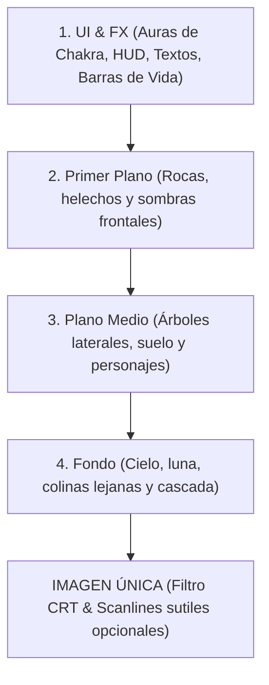

# Guía de Dirección de Arte: Batallas y Sprites (Painted HQ Neo-Retro)

Este documento define el **canon visual oficial** de las escenas de batalla de **Shinobi Way: The Infinite Tower**. Se basa en la composición por capas de referencia (`Gemini_Generated_Image_64gaug64gaug64ga.png`) y en el chrome arcade de `naruto_retro_arcada.jfif` — **sin** imponer sprites 16-bit / SNES como estilo principal de personajes o enemigos.

---

## 🔒 Style lock (canon)

| Capa conceptual | Estilo | Dónde aplica |
|-----------------|--------|--------------|
| **Contenido** | **Painted HQ** / ilustración digital neo-retro, cel-shaded, outlines duros, atmósfera seinen | Sprites/cutouts de héroe y enemigo, pósters, skills, láminas pintadas (BG/MID/FG) |
| **Chrome** | **Pixel-arcade** retro | UI, HUD, fuentes display, botones, sombras duras sin blur |
| **Opcional sutil** | CRT/scanlines ligeros, grain pixel sutil en fondos escénicos, hard-shadow UI | Overlay de escena, mood de placa — **nunca** aplastar sujetos pintados a 8-bit chunky |
| **Alpha** | Cutouts siempre **RGBA real** | Generación con chroma `#00FF00` / `#FF00FF` (o azul); sin matte negro |

**Anti-canon:** no describir ni generar personajes/enemigos como *"16-bit pixel art sprite"* / *"SNES game asset"* como descriptor primario. El pixel-arcade vive en el marco y el HUD; el show es pintura HQ con legibilidad de arcade (outline + cel-shade).

---

## 📸 1. Análisis de Composición por Capas (Deconstrucción)

La imagen de referencia demuestra que la escena de batalla debe construirse en **capas superpuestas (Láminas)** en lugar de usar un fondo plano. Esto permite efectos de profundidad, parallax y animaciones focalizadas sin sobrecargar el rendimiento.



### Detalle de las Capas

1.  **Capa 4: Fondo (Background Elements)**
    *   **Contenido**: El cielo nocturno degradado (azul oscuro a violeta), la luna creciente brillante, siluetas de montañas boscosas cubiertas por la niebla y la cascada central en caída libre.
    *   **Función**: Aporta la atmósfera global y la profundidad. Tonos más fríos y desaturados hacen que los personajes del plano medio resalten.
    *   **Estilo**: ilustración digital pintada (HQ); opcional grain/pixel sutil o mood neo-geo en la placa, sin convertir el fondo en tileset 16-bit puro.
    *   **Animación**: La cascada puede animarse mediante un loop simple (p. ej. 4 frames o scroll de textura).
2.  **Capa 3: Estructura del Plano Medio (Middle-ground Structure)**
    *   **Contenido**: El suelo de tierra/arena transitable, y los dos árboles monumentales con musgo e hiedra a los lados que enmarcan el duelo.
    *   **Función**: Base física donde se posicionan y mueven los sprites (Hikaru y Kagero). Los árboles laterales actúan como límites visuales naturales.
3.  **Capa 2: Elementos de Primer Plano (Foreground Elements)**
    *   **Contenido**: Rocas oscuras en los extremos inferiores y vegetación de oclusión (helechos u hojas pintadas).
    *   **Función**: Oclusión parcial del suelo y pies en los extremos → profundidad 3D en un entorno 2D.
4.  **Capa 1: Interfaz y Efectos Especiales (UI & FX)**
    *   **Contenido**: Auras de chakra (difusas, color por elemento/bando), barras de HP/Chakra, iconos del HUD, textos.
    *   **Estilo**: **chrome pixel-arcade** (fuentes display, sombras duras, botones) sobre la escena pintada.
    *   **Función**: Capa interactiva: estado del combate y decisiones del jugador.

---

## 🎨 2. Reglas del Estilo de Sprites (Personajes)

Canon de **contenido**: ilustración digital HQ neo-retro (anime/seinen), no sprite SNES puro.

*   **Delineado Negro (Outlines)**: Borde oscuro definido (≈1–2 px a escala de asset o trazo duro equivalente). Evita que el sujeto se mezcle con el bosque o la niebla.
*   **Cel-Shading**: Sombras en bloques legibles (pocos tonos por zona de color). Evitar degradados fotorealistas suaves que maten la silueta de combate.
*   **Painted HQ / volumen**: Detalle de ropa, metal, tela y rostro propio de ilustración digital de calidad; posterización ligera opcional como *polish* neo-retro, no como pixel-art chunky.
*   **Halo de Chakra (Inner & Outer Glow)**: Brillo externo sutil (verde/amarillo héroe, azul/celeste enemigo) que proyecta luz secundaria sobre los bordes del sprite. Preferible por CSS dinámico, no pintado a mano en cada frame.
*   **Alpha**: Cutout siempre RGBA real tras chroma-key. Sin halo suave que contamine el key.

---

## 🛠️ 3. Implementación Técnica en Shinobi Way

Look objetivo: **painted HQ + chrome arcade + CRT opcional sutil** en React + CSS.

### A. Estructura de Capas CSS (Z-Index)
En el contenedor de la escena de combate (`Combat.tsx`), se renderizan las capas de forma apilada:

```css
.combat-scene {
  position: relative;
  width: 1024px;
  height: 576px; /* Relación de aspecto 16:9 de arcade */
  overflow: hidden;
}

.layer-background { z-index: 10; position: absolute; }
.layer-middleground { z-index: 20; position: absolute; }
.layer-sprites { z-index: 30; position: absolute; }
.layer-foreground { z-index: 40; position: absolute; }
.layer-ui-fx { z-index: 50; position: absolute; }
```

> **Estado:** objetivo de diseño de esta guía. Verificar en `src/scenes/combat/Combat.css` qué clases existen ya; no asumir `.layer-*` ni CRT sin implementarlos. Preferir tokens `--sw-*` del design-system.

### B. Efecto de Aura con Filtros CSS
Para evitar versiones duplicadas de sprites con auras dibujadas a mano:

```css
/* Aura del personaje principal (Chakra de viento/vital) */
.sprite-hero {
  filter: drop-shadow(0 0 8px rgba(34, 197, 94, 0.75))
          drop-shadow(0 0 2px rgba(187, 247, 208, 0.5));
  /* Painted HQ: no forzar image-rendering: pixelated en sujetos pintados
     (eso aplasta anti-alias y detalle). Reservar pixelated a iconos/chrome UI. */
}

/* Aura del enemigo (Chakra oscuro/elemental) */
.sprite-enemy {
  filter: drop-shadow(0 0 8px rgba(37, 99, 235, 0.75))
          drop-shadow(0 0 2px rgba(191, 219, 254, 0.5));
}
```

### C. Simulación del Filtro CRT y Scanlines (opcional, sutil)
Overlay en la capa superior para mood de monitor arcade — **ligero**, sin aplastar la pintura:

```css
.crt-overlay::after {
  content: " ";
  display: block;
  position: absolute;
  top: 0; left: 0; bottom: 0; right: 0;
  background: linear-gradient(
    rgba(18, 16, 16, 0) 50%, 
    rgba(0, 0, 0, 0.25) 50%
  );
  background-size: 100% 4px; /* Simulación de scanlines */
  z-index: 100;
  pointer-events: none; /* Permite hacer clic en los botones de abajo */
}

/* Curvatura sutil de pantalla tipo esférico */
.crt-screen {
  border-radius: 20px;
  box-shadow: inset 0 0 80px rgba(0, 0, 0, 0.6),
              0 0 20px rgba(0, 0, 0, 0.8);
}
```

---

## 📝 4. Fórmulas de Prompts para Generación de Assets por IA

### Style lock en prompts
*   **Personajes / cutouts / pósters / skills:** `painted digital illustration, high quality, cel-shaded, hard black outlines, neo-retro seinen atmosphere` — **no** `16-bit pixel art sprite` como descriptor principal.
*   **Láminas de location (BG/MID):** painted HQ; opcional `subtle pixel grain`, `neo-geo arcade mood`, `slight posterization` — no tileset SNES puro.
*   **Chrome UI:** skill `pixel-arcade` (fuera del prompt de personaje).

### Para Fondos por Capas (Scenic Elements)
*   **Fondo Lejano (Capa 4)**:
    *   `Painted digital illustration background, high quality, distant misty waterfall in a forest at night under a crescent moon, cool blue and dark purple color palette, neo-retro seinen atmosphere, optional subtle pixel grain, arcade scenic plate mood --ar 16:9`
*   **Plano Medio (Capa 3)**:
    *   `Painted digital illustration middleground, high quality, two massive ancient mossy trees framing left and right sides, flat dirt ground path in the center, cel-shaded, hard outlines, isolated scenic element, flat pure green screen background #00FF00, no gradients on background --ar 16:9`

### Chroma key para cutouts (producción)
Cualquier asset que se vaya a recortar a alpha real (`enemy_cut_*`, heroes, láminas mid/fg, props):
*   **Default:** fondo plano **green screen** `#00FF00` (`flat pure green screen background #00FF00, no gradients, no cast shadows on background`).
*   **Si el sujeto es verde-heavy** (musgo, follaje, chakra verde, slime…): **magenta** `#FF00FF` o **azul** `#0000FF`.
*   **Prohibido** matte negro para cutouts nuevos (se come ropa/pelo/botas oscuras). Tras generar → chroma-key a PNG RGBA.

### Para Retratos y Sprites de Enemigos (Asset Companion)
*   **Enemigo Boss / Rogue Ninja** (cutout-ready):
    *   `Painted digital illustration, high quality character portrait of a dangerous ninja warrior wearing a detailed metallic gas mask and ragged dark cloak, holding a small sickle weapon. Cel-shaded lighting, hard black outlines, neo-retro seinen atmosphere, isolated subject, flat pure green screen background #00FF00, no gradients, no cast shadows on background. NOT 16-bit pixel art, NOT SNES sprite.`
